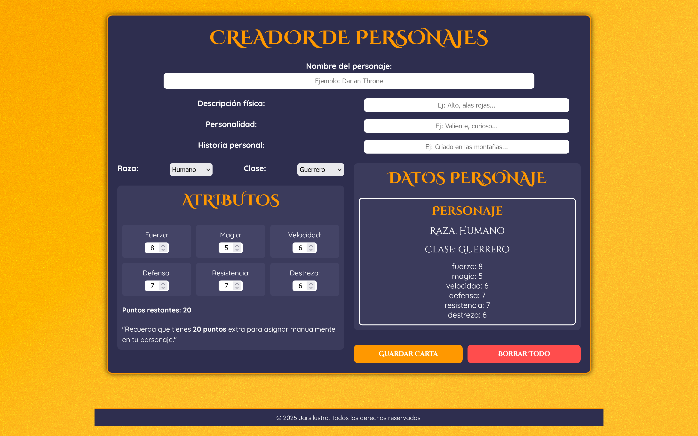

**Character Create**

Este proyecto es una aplicación web interactiva diseñada para la creación y personalización de personajes en entornos de fantasía. Permite a los usuarios definir características 
como nombre, raza, clase, descripción física, personalidad e historia personal, además de asignar puntos a distintos atributos para construir perfiles únicos.

Puedes ver la versión actual del proyecto aquí:  
👉 [**Ver Demo en GitHub Pages**](https://jarsilustra.github.io/Character_Create/)

---

**Ver. Esp** 

**Creador de Personajes Interactivo**

Imagina poder dar vida a tus propios héroes y aventureros con solo unos clics. Este proyecto es una herramienta web dinámica y visualmente atractiva que permite a los usuarios crear 
y personalizar personajes de fantasía de forma sencilla e intuitiva. Desde elegir la raza y clase hasta definir su historia y personalidad, la aplicación ofrece una experiencia interactiva y divertida, mostrando en tiempo real cómo va quedando tu
personaje. Además, incorpora un sistema para asignar atributos y guardar o reiniciar los datos con un solo botón.

El diseño es totalmente responsive, adaptándose a móviles, tablets y escritorio, con una estética moderna inspirada en mundos de rol y fantasía. Es perfecta para proyectos creativos, 
juegos de mesa o videojuegos que requieran personalización de personajes.

---

**Ver. Eng**

**Interactive Character Creator**

Bring your own heroes and adventurers to life with just a few clicks. This project is a dynamic and visually engaging web tool that allows users to create and customize fantasy 
characters in a simple and intuitive way. From selecting race and class to defining backstory and personality, the app provides a fun, interactive experience with real-time character 
previews. It also includes a stat point allocation system and convenient save or reset buttons.

The design is fully responsive, adapting seamlessly to mobile, tablet, and desktop devices, with a modern aesthetic inspired by fantasy and role‑playing worlds. Perfect for 
creative projects, tabletop games, or video games that require character customization.

---
